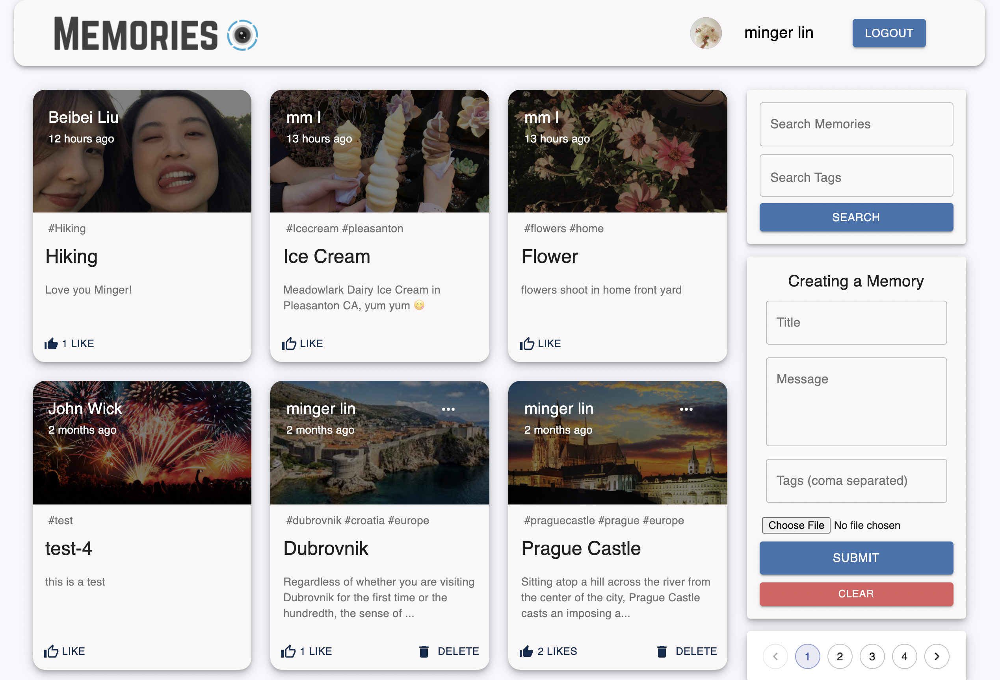

# Memories

CHECK THIS OUT!

(https://mernprojectmemoriesmingerlin.netlify.app)

## Introduction

This is a code repository for the corresponding video tutorial - https://youtube.com/playlist?list=PL6QREj8te1P7VSwhrMf3D3Xt4V6_SRkhu.

Using React, Node.js, Express & MongoDB to build a Full Stack MERN Application. The App is called "Memories" and it is a simple social media app that allows users to post interesting events that happened in their lives.

TODO: add some cool functionalities to post detail page.
